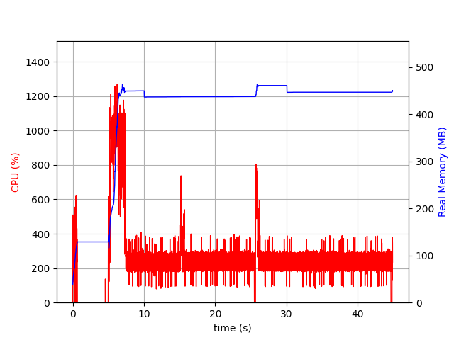
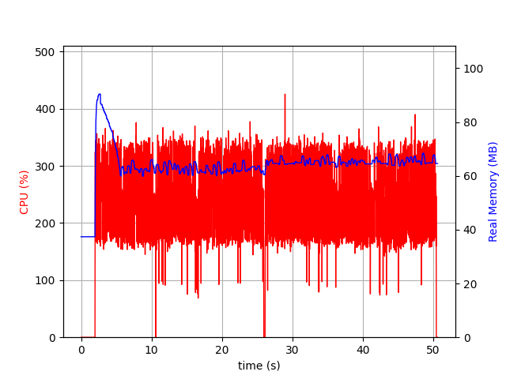

# Quarkus Photobook Demo App

[](https://github.com/fugerit-org/quarkus-photobook/blob/master/CHANGELOG.md)
[](https://opensource.org/licenses/Apache-2.0)
[](https://github.com/fugerit-org/fj-universe/blob/main/CODE_OF_CONDUCT.md)
[](https://sonarcloud.io/summary/new_code?id=fugerit-org_quarkus-photobook)
[](https://sonarcloud.io/summary/new_code?id=fugerit-org_quarkus-photobook)
[](https://hub.docker.com/repository/docker/fugeritorg/quarkus-photobook/general)

## Introduction

Recently I followed some [Mongo DB courses](https://learn.mongodb.com/) and attended the [Spring I/O 2023](https://2023.springio.net/).  
So I decided to practice a bit. This project is the result.  
Currently is just a simple POC integration of Mongo DB and Quarkus

There is a live version at the link [https://springio23.fugerit.org/photobook-demo/home/index.html](https://springio23.fugerit.org/photobook-demo/home/index.html)

This is an alternate version of the [springboot project](https://github.com/fugerit-org/springboot-photobook/) based on [quarkus](https://quarkus.io/)

## Prerequisites

| software                                                                                                                                                                                                 | docker compose | local build and run |
|----------------------------------------------------------------------------------------------------------------------------------------------------------------------------------------------------------|----------------|---------------------|
| [](https://universe.fugerit.org/src/docs/versions/java21.html)   | no             | yes                 |
| [](https://universe.fugerit.org/src/docs/versions/gvm21.html) | no             | yes                 |
| [](https://universe.fugerit.org/src/docs/versions/maven3_9.html)       | no             | yes                 |
| [](https://universe.fugerit.org/src/docs/versions/node.html)                               | no             | yes                 |
| [](https://universe.fugerit.org/src/docs/versions/docker.html)                                  | yes            | no                  |

## Quickstart 

### Start via docker compose

```shell
docker-compose -f src/main/docker/docker-compose.yml up -d
```

### Start in dev mode

1. Create mongo db instance with db initialization (script src/test/resources/mongo-db/mongo-init.js) :

```shell
docker run --rm -p 27017:27017 --name MONGO8 -v `pwd`/src/test/resources/mongo-db/mongo-init.js:/docker-entrypoint-initdb.d/mongo-init.js mongo:8.0.0-rc7
```

This will start a mongo db linked on the default port and with the default username/password (root/example).

2. Start the application in dev mode

The back end

```shell
mvn quarkus:dev
```

And front end

```shell
cd src/main/react
npm install
npm run start
```

3. Access home page

<http://localhost:8080/photobook-demo/home/index.html>

## environment variables

In case you want a custom mongo db connection :

| key         | dedault                                  | 
|-------------|------------------------------------------|
| MONGODB_URL | mongodb://localhost:27017/photobook_demo |

## Quarkus package

It is possible to compile the application to a single jar package :

```shell
mvn package -Pbuildreact
```

And then run

```shell
java -jar target/quarkus-app/quarkus-run.jar
```

## Native image compilation

The code has been set for native compilation with [GraalVM](https://www.graalvm.org/) (tested with GraalVM 22.3 CE).  

It is possible to compile :

```shell
mvn install -Dnative -Pbuildreact
```

And then run

```shell
./target/quarkus-photobook*-runner
```

Refer to [Quarkus Documentation](https://quarkus.io/guides/building-native-image) for more informations.

## Docker image

### docker container (jvm)

Build quarkus application (jar)

```shell
mvn package -P buildreact
```

Build container openjdk

```shell
docker build -t quarkus-photobook-jvm -f src/main/docker/Dockerfile.jvm .
```

Running the container :

```shell
docker run -it -p 8080:8080 --name quarkus-photobook-jvm quarkus-photobook-jvm
```

### docker container (native)

Building the native image :

```shell
mvn -Dnative -Pbuildreact
```

Building the container image : 

```shell
docker build -t quarkus-photobook-native -f src/main/docker/Dockerfile.native .
```

Running the container :

```shell
docker run -it -p 8080:8080 --name quarkus-photobook-native quarkus-photobook-native
```

## Native optimization : PGO

This section is based on <https://github.com/alina-yur/native-spring-boot>.

One of the most powerful performance optimizations in Native Image is profile-guided optimizations (PGO).

1. Build an instrumented image:

```shell
mvn package -Dnative -Pinstrumented
```

2. Run the app and apply relevant workload:

```shell
mv ./target/quarkus-photobook*runner ./target/quarkus-photobook-instrumented
```

```shell
./target/quarkus-photobook-instrumented
```

```shell
hey -n=30000 http://localhost:8080/photobook-demo/api/photobook/view/list
```

```shell
hey -n=30000 http://localhost:8080/photobook-demo/api/photobook/view/images/springio23/language/it/current_page/1/page_size/5
```

after you shut down the app, you'll see an `iprof` file in your working directory.

3. Build an app with profiles (they are being picked up via `<buildArg>--pgo=${project.basedir}/default.iprof</buildArg>`):

```shell
mvn package -Dnative -Poptimized
```

## Benchmark scripts

Prerequisites :
- running mongo db
- `hey` installed
- `psrecord` installed

At the end of a run, an image will be plotted in the `target` folder.

### 1. Benchmark JIT

```shell
mvn clean package
```

```shell
./src/main/script/bench-jit.sh
```

### 2. Benchmark native

Follow steps in 'Native optimization : PGO' section

```shell
./src/main/script/bench-native.sh
```

### 3. Benchmark result

Sample result of JIT benchmark run :



Sample result of native (AOT) benchmark run :



## application stack

| Layer             | 2024 version   |
|-------------------|----------------|
| Persistence       | MongoDB 8      |
| Java version      | GraalVM 21     |
| API REST          | Quarkus 3.11.x |
| Node JS           | Node 20        |
| Front end package | Vite           |
| Front end UI      | React 18.3     |